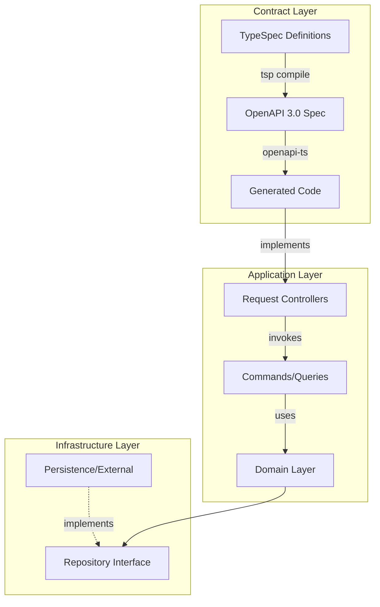

# Nest Pokemon

A **contract-first** NestJS Pokédex API built with [TypeSpec](https://typespec.io/), [OpenAPI](https://www.openapis.org/), and [@hey-api/openapi-ts](https://heyapi.dev/).

The API is defined in TypeSpec, compiled to an OpenAPI 3.0 spec, and then used to generate TypeScript types, Zod schemas, NestJS controller interfaces, and an SDK — keeping the implementation and documentation in sync by design.

## Architecture

This project follows a **Contract-First** approach combined with **Clean Architecture** principles.



### Key concepts

| Concept                   | How it works                                                                                                                                                                     |
| ------------------------- | -------------------------------------------------------------------------------------------------------------------------------------------------------------------------------- |
| **Contract-first**        | The API contract is authored in TypeSpec (`tsp/`). All generated code derives from it.                                                                                           |
| **Granular Controllers**  | Instead of monolithic controllers, each endpoint is handled by a "Request" class (e.g., `CreatePokemonRequest`) that implements a specific method from the generated interfaces. |
| **Application Layer**     | Business logic is encapsulated in Commands and Queries, keeping the presentation layer (controllers) thin and focused on HTTP concerns.                                          |
| **Runtime validation**    | A custom `ZodPipe` validates incoming request params/body against the generated Zod schemas.                                                                                     |
| **Typed error handling**  | Services return `Result` types (`@praha/byethrow`) and use `@praha/error-factory` for domain-specific errors. Controllers pattern-match on results with `ts-pattern`.            |

## Project structure

```
├── tsp/                    # TypeSpec definitions (The "Source of Truth")
│   ├── main.tsp            #   Service metadata & imports
│   ├── health.tsp          #   Health-check endpoints
│   ├── pokedex.tsp         #   Pokédex CRUD endpoints
│   └── models/             #   Shared models (Pokemon, pagination, etc.)
├── tsp-output/
│   └── openapi.yaml        # Generated OpenAPI 3.0 spec
├── src/
│   ├── generated/          # Auto-generated code (DO NOT EDIT)
│   │   ├── types.gen.ts    #   TypeScript types
│   │   ├── zod.gen.ts      #   Zod validation schemas
│   │   ├── nestjs.gen.ts   #   NestJS controller interfaces
│   │   └── sdk.gen.ts      #   API client SDK
│   ├── pokemon/            # Pokemon module (Clean Architecture)
│   │   ├── application/    #   Commands & Queries
│   │   ├── domain/         #   Entities, Value Objects & Repository Interfaces
│   │   ├── infrastructure/ #   Persistence (Repository implementation)
│   │   ├── presentation/   #   Request Controllers
│   │   └── pokemon.module.ts
│   ├── health/             # Health module
│   │   ├── queries/
│   │   ├── requests/
│   │   └── health.module.ts
│   ├── zod.pipe.ts         # Generic ZodPipe for request validation
│   ├── app.module.ts
│   └── main.ts
├── tspconfig.yaml          # TypeSpec compiler config
└── tsconfig.json
```

## Prerequisites

- **Node.js** ≥ 18
- **npm**

## Getting started

```bash
# Install dependencies
npm install

# Compile the TypeSpec definitions into an OpenAPI spec
npm run typespec:compile

# Generate types, schemas, and NestJS interfaces from the OpenAPI spec
npx openapi-ts

# Start the dev server (watch mode)
npm run start:dev
```

The API will be available at **http://localhost:3000**.

## Notable libraries

| Library                                                       | Purpose                                                           |
| ------------------------------------------------------------- | ----------------------------------------------------------------- |
| [`@typespec/compiler`](https://typespec.io/)                  | API-first contract definition language                            |
| [`@hey-api/openapi-ts`](https://heyapi.dev/)                  | Generate types, Zod schemas, NestJS interfaces & SDK from OpenAPI |
| [`zod`](https://zod.dev/)                                     | Runtime request validation via generated schemas                  |
| [`@praha/byethrow`](https://github.com/praha-inc/byethrow)    | Type-safe `Result` monad for error handling                       |
| [`@praha/error-factory`](https://github.com/praha-inc/praha)  | Factory for creating structured, type-safe errors                 |
| [`ts-pattern`](https://github.com/gvergnaud/ts-pattern)       | Exhaustive pattern matching on `Result` types                     |

## License

UNLICENSED
