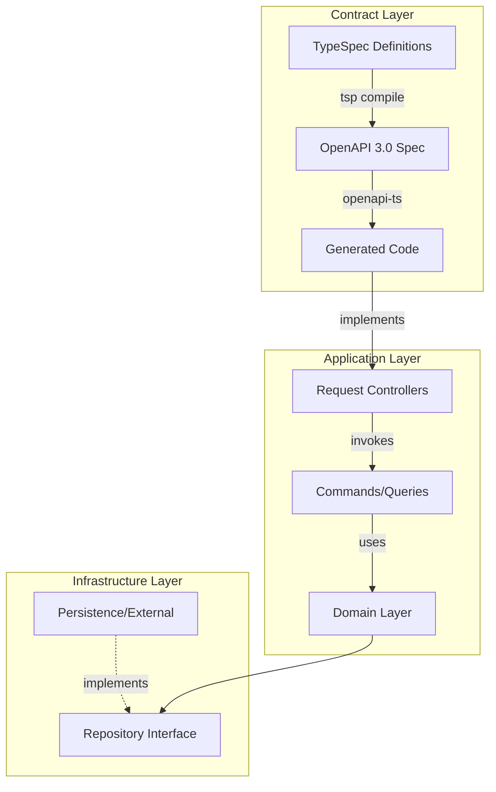

# Nest Pokemon

A **contract-first** NestJS Pokédex API built with [TypeSpec](https://typespec.io/), [OpenAPI](https://www.openapis.org/), and [@hey-api/openapi-ts](https://heyapi.dev/).

The API is defined in TypeSpec, compiled to an OpenAPI 3.0 spec, and then used to generate TypeScript types, Zod schemas, and NestJS controller interfaces — keeping the implementation and documentation in sync by design.

## Architecture

This project follows a **Contract-First** approach combined with **Clean Architecture** principles.


```mermaid
graph TD
    subgraph "Contract Layer"
    TSP[TypeSpec Definitions] -->|tsp compile| OAS[OpenAPI 3.0 Spec]
    OAS -->|openapi-ts| GEN[Generated Code]
    end

    subgraph "Application Layer"
    GEN -->|implements| REQ[Request Controllers]
    REQ -->|invokes| CQ[Commands/Queries]
    CQ -->|uses| DOM[Domain Layer]
    end

    subgraph "Infrastructure Layer"
    INF[Persistence/External] -.->|implements| POK_REP_INT[Repository Interface]
    DOM --> POK_REP_INT
    end
```

### Key concepts

| Concept                   | How it works                                                                                                                                                                     |
| ------------------------- | -------------------------------------------------------------------------------------------------------------------------------------------------------------------------------- |
| **Contract-first**        | The API contract is authored in TypeSpec (`tsp/`). All generated code derives from it.                                                                                           |
| **Granular Controllers**  | Instead of monolithic controllers, each endpoint is handled by its own controller class (e.g., `CreatePokemonController`) that implements a single method (`Pick<…>`) of the generated interface. |
| **Application Layer**     | Business logic is encapsulated in Commands and Queries, keeping the presentation layer (controllers) thin and focused on HTTP concerns.                                          |
| **Runtime validation**    | Generated Zod schemas are Standard Schema-compatible and passed to the route decorators (`@Body/@Query/@Param({ schema })`). NestJS 12's native `StandardSchemaValidationPipe` (registered in `src/main.ts`) validates them — no custom pipe. |
| **Typed error handling**  | Services return `Result` types (`@praha/byethrow`) and use `@praha/error-factory` for domain-specific errors. Controllers pattern-match on results with `ts-pattern`.            |

## Project structure

```
├── tsp/                    # TypeSpec definitions (The "Source of Truth")
│   ├── main.tsp            #   Service metadata & imports
│   ├── health.tsp          #   Health-check endpoints
│   ├── pokedex.tsp         #   Pokédex CRUD endpoints
│   └── models/             #   Shared models (Pokemon, pagination, etc.)
├── tsp-output/
│   └── openapi.yaml        # Generated OpenAPI 3.0 spec
├── src/
│   ├── generated/          # Auto-generated code (DO NOT EDIT)
│   │   ├── types.gen.ts    #   TypeScript types
│   │   ├── zod.gen.ts      #   Zod validation schemas
│   │   └── nestjs.gen.ts   #   NestJS controller interfaces
│   ├── pokemon/            # Pokemon module (Clean Architecture)
│   │   ├── presentation/   #   Controllers (one per endpoint)
│   │   ├── application/    #   Commands & Queries
│   │   ├── domain/         #   Entities, Value Objects & Repository Interfaces
│   │   ├── infrastructure/ #   Persistence (Repository implementation)
│   │   └── pokemon.module.ts
│   ├── health/             # Health module (same layering as pokemon)
│   │   ├── presentation/   #   Controllers (one per endpoint)
│   │   ├── application/    #   Queries (one per endpoint)
│   │   └── health.module.ts
│   ├── app.module.ts
│   └── main.ts             # Bootstraps the app + StandardSchemaValidationPipe
├── tspconfig.yaml          # TypeSpec compiler config
└── tsconfig.json
```

## Prerequisites

- **Node.js** ≥ 22 (the project is native ESM and targets ES2023)
- **npm**

## Getting started

```bash
# Install dependencies
npm install

# Compile TypeSpec -> OpenAPI and generate types, Zod schemas
# & NestJS interfaces in one step
npm run generate

# Start the dev server (watch mode)
npm run start:dev
```

The API will be available at **http://localhost:3000**.

## Scripts

| Script              | Purpose                                                          |
| ------------------- | ---------------------------------------------------------------- |
| `npm run generate`  | Compile TypeSpec to OpenAPI, then regenerate `src/generated/`.   |
| `npm run start:dev` | Start the dev server in watch mode (Rspack builder).             |
| `npm run build`     | Production build via the Nest Rspack builder.                    |
| `npm run lint`      | Lint & autofix with oxlint (generated code excluded).            |
| `npm run test`      | Run unit specs (`*.spec.ts`) with Vitest.                        |
| `npm run test:e2e`  | Run e2e specs (`*.e2e-spec.ts`) with Vitest.                     |
| `npm run check`     | Quality gate: lint + build + unit tests.                         |

## Agent instructions

This repository is optimized for AI agents (Gemini, Claude, etc.).
See [AGENTS.md](./AGENTS.md) and [GEMINI.md](./GEMINI.md) for architectural conventions, rules, and best practices for contributing to this codebase.

## Notable libraries

| Library                                                       | Purpose                                                           |
| ------------------------------------------------------------- | ----------------------------------------------------------------- |
| [`@typespec/compiler`](https://typespec.io/)                  | API-first contract definition language                            |
| [`@hey-api/openapi-ts`](https://heyapi.dev/)                  | Generate types, Zod schemas & NestJS interfaces from OpenAPI      |
| [`zod`](https://zod.dev/)                                     | Runtime request validation via generated schemas                  |
| [`@praha/byethrow`](https://github.com/praha-inc/byethrow)    | Type-safe `Result` monad for error handling                       |
| [`@praha/error-factory`](https://github.com/praha-inc/praha)  | Factory for creating structured, type-safe errors                 |
| [`ts-pattern`](https://github.com/gvergnaud/ts-pattern)       | Exhaustive pattern matching on `Result` types                     |

## Tooling

| Tool                                        | Purpose                                                     |
| ------------------------------------------- | ----------------------------------------------------------- |
| [`oxlint`](https://oxc.rs/docs/guide/usage/linter) | Fast Rust-based linter (replaces ESLint).            |
| [`Vitest`](https://vitest.dev/)             | Unit & e2e test runner.                                     |
| [`Rspack`](https://rspack.dev/)             | Build via the `@nestjs/cli` Rspack builder.                 |

## License

UNLICENSED
